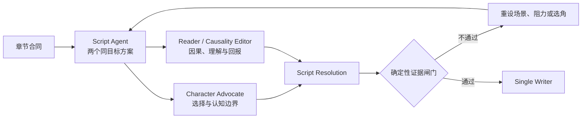
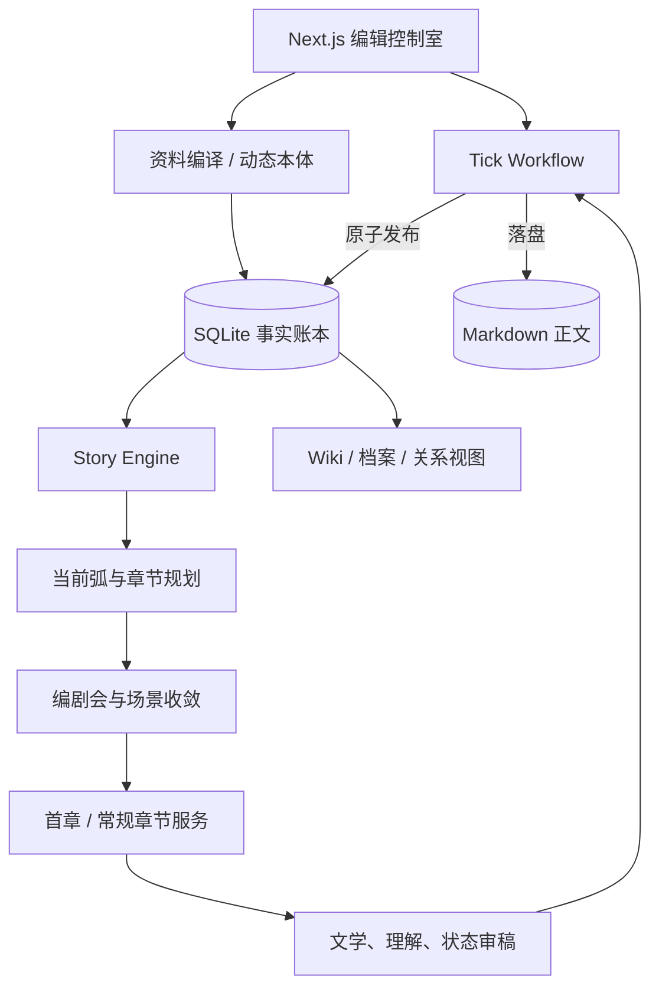

<div align="center">

# SeedWorld

### 让世界先发生，再把它写下来。

基于事实账本、角色认知边界与滚动主线的长篇小说创作工作台。

[核心设计](#核心设计) · [工作流](#从世界资料到正式章节) · [系统架构](#系统架构) · [本地运行](#本地运行) · [详细说明](./docs/PROJECT_OVERVIEW.zh-CN.md)

</div>


## SeedWorld 是什么

SeedWorld 不是一次性扩写提示词的写作界面，也不是让多个角色自由行动后再把结果拼成正文的模拟器。

它面向长篇小说中最容易失控的问题：

- 设定、历史和人物状态不断增加，后续章节遗忘前文；
- 角色知道了不该知道的秘密；
- 世界演化与实际正文脱节；
- 多 Agent 各写一段，最终正文变成流水账；
- 大纲过死会强迫人物配合，大纲过松又会让故事漂移；
- 草稿失败后，事件却已经污染正式世界。

SeedWorld 将一次正式创作固定成可追踪、可恢复的生产链：

```text
作品资料
→ 动态本体与事实账本
→ 作品故事发动机
→ 当前故事弧
→ 下一章微型故事合同
→ 多 Agent 编剧会
→ 单一 Writer 成章
→ 三重审稿
→ 原子发布
```

只有已经发布的事实才属于正式世界。候选方案、讨论、草稿与待提交变化不会提前写入事实账本。

## 核心设计

### 世界事实、角色认知、读者认知分离

同一命题可以同时处于三种状态：世界中客观发生了什么、某个角色相信什么，以及正文已经让读者知道什么。秘密、误解、谣言、欺骗和有限视角因此成为可验证的数据边界。

### 每部作品拥有独立本体

平台只固定 `Entity`、`Claim`、`Event`、`Rule`、`KnowledgeState` 与 `Transmission` 等表达机制。人物、阵营、异能、合同、门派或自然现象由当前作品资料动态生成，不写死题材模板。

### 当前故事弧是硬主线

SeedWorld 不要求作者在开篇前决定最终真相和人物结局。系统锁定当前故事弧的目标、阻力、完成条件与代价，并保留多个尚未承诺的远期方向。

每章首先回答：

> 当前故事弧距离完成还缺少什么，而上一章留下了什么必须处理的后果？

### 一轮推演对应一章

正式 Tick 不会独立于正文不断演化。角色意图只参与场景论证；章节未通过审稿时，下一轮不会开始，正式世界也不会偷偷前进。

### Writer 独占正文

角色 Agent、剧本 Agent 和专家 Agent 只提交结构化意图、审议问题与修复方向。最终只有一个 Writer 根据批准后的连续场景链写完整章节，禁止按 Agent 顺序汇报。

## 从世界资料到正式章节


### 1. 资料编译

作者可以输入世界底稿，也可以导入 Markdown、TXT 或 PDF。系统保存来源和分块，再抽取实体、命题、规则、历史事件与知识边界。SQLite 是唯一事实源，Wiki、摘要和关系视图只是只读投影。

### 2. 作品故事发动机

Story Engine 描述当前作品独有的叙事循环：核心体验、冲突情境、人物常用方法、对抗来源、稀缺资源、失败代价、成长回报、变化轴与枯竭信号。

发动机由 AI 生成草案、作者确认。它约束“为什么值得继续读”，但不会替人物预先决定结局。

### 3. 下一章微型故事合同

系统只详细锁定下一章：

| 字段 | 作用 |
| --- | --- |
| 即时目标 | POV 本章具体想完成什么 |
| 核心阻碍 | 什么真正阻止目标 |
| 困难选择 | 哪些选项都需要付出代价 |
| 状态变化 | 本章结束后世界发生什么主要变化 |
| 局部回报 | 本章给予读者的答案、胜负、发现或情绪结算 |
| 下一压力 | 哪项后果自然启动下一章 |
| 删除损失 | 删除本章会破坏哪条明确因果 |

首章由独立 Opening Workshop 处理，使用更严格的人物与信息预算。

### 4. 自适应多 Agent 编剧会



普通章节使用精简编剧会；故事弧首章、结算章、重大秘密揭示或高连续性风险章节会启用完整专家组。系统不采用投票，事实、认知或人物边界错误不会因为多数 Agent 支持而被放行。

### 5. 三重审稿

1. **文学审稿**：视角、微型故事弧、节奏、对话职责、钩子与流水账问题。
2. **读者理解审稿**：在不读取答案版世界档案的前提下复述目标、阻碍、选择、结果和回报。
3. **状态证据审稿**：检查世界变化是否在正文中真正发生，并验证知识、规则和能力代价。

任一审查出现关键错误，章节都不能发布。

### 6. 原子发布

正文、事件、状态变化、人物认知、关系、读者揭示、问题状态和故事弧进度通过同一次事务提交。发布失败时，世界保持在上一正式章节。

## 系统架构



### 主要代码边界

```text
app/
  api/worlds/                   世界、资料、推演与章节 API
  worlds/                       作品库、创建页与作品工作台

src/domain/
  narrative-workflow.ts         工作流、章节合同与状态变化
  story-engine-validation.ts    故事发动机约束
  story-closure-validation.ts   滚动主线与收敛条件

src/server/
  extraction-service.ts         资料编译
  story-engine-service.ts       作品故事发动机
  narrative-planning-service.ts 当前弧与下一章规划
  scene-resolution-service.ts   编剧会与场景收敛
  opening-workshop-service.ts   首章专用工作坊
  opening-chapter-service.ts    首章正文流水线
  chapter-service.ts            常规章节与审稿
  reader-story-service.ts       读者问题与理解状态
  tick-workflow-service.ts      一轮一章的可恢复工作流
  database.ts                   SQLite schema 与迁移
```

## 工作空间

- **创作台**：当前故事弧、下一章合同、编剧会、生成状态和审稿证据；
- **设定库**：实体、规则、事实来源、角色认知、秘密与关系；
- **章节库**：阅读、比较和管理已经发布的 Markdown 章节。

界面采用暖纸背景、黑墨文字、方形边界与单一橙色焦点，保持编辑部账本式的信息密度。

## 技术栈

- Next.js 14 / React 18 / TypeScript
- SQLite 本地持久化
- OpenAI-compatible / Anthropic-compatible 模型适配
- Zod 结构化输出校验
- Vitest + Testing Library
- Graphology / Sigma（可选关系视图）

## 本地运行

```bash
git clone https://github.com/zmzhace/SeedWorld.git
cd SeedWorld
npm install
cp .env.example .env.local
npm run dev
```

打开 `http://localhost:3000`。模型密钥只应存在于服务端环境变量中，不应写入代码、数据库、浏览器存储或提交记录。

```bash
npm test
npm run build
```

## 项目状态

SeedWorld 仍在持续演进。仓库中保留了部分早期世界模拟代码，用于旧作品兼容和沙盒预演；正式小说生产链以 SQLite 事实账本、当前故事弧、一轮一章工作流与原子发布为准。

项目不会宣称尚未验证的生成质量、性能指标或用户规模。真正的可用性以首章、连续章节和完整故事弧的真实回归验收为准。

更完整的设计说明见：[SeedWorld 项目总览](./docs/PROJECT_OVERVIEW.zh-CN.md)。

---

<div align="center">

**世界负责留下后果，章节负责赋予后果意义。**

</div>
