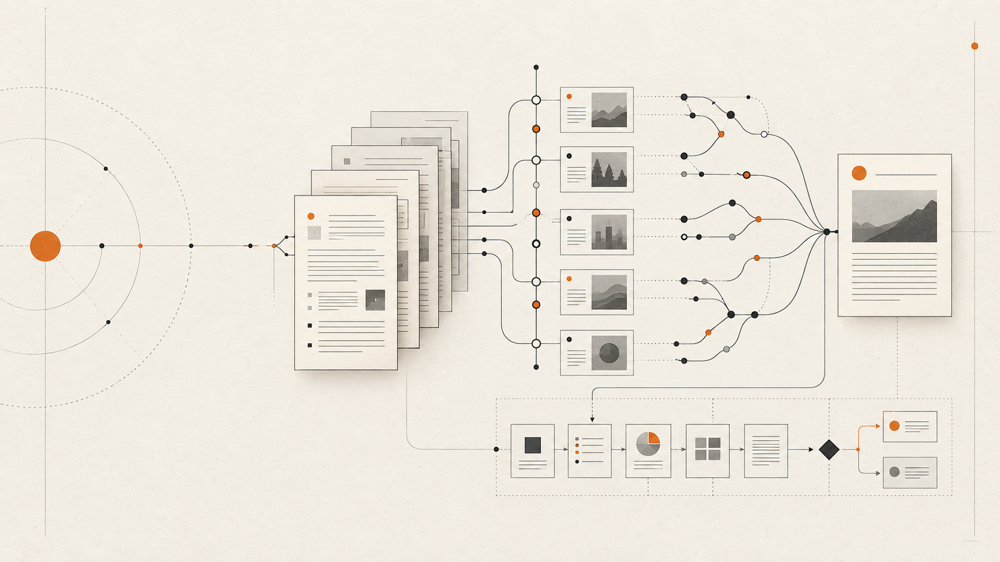
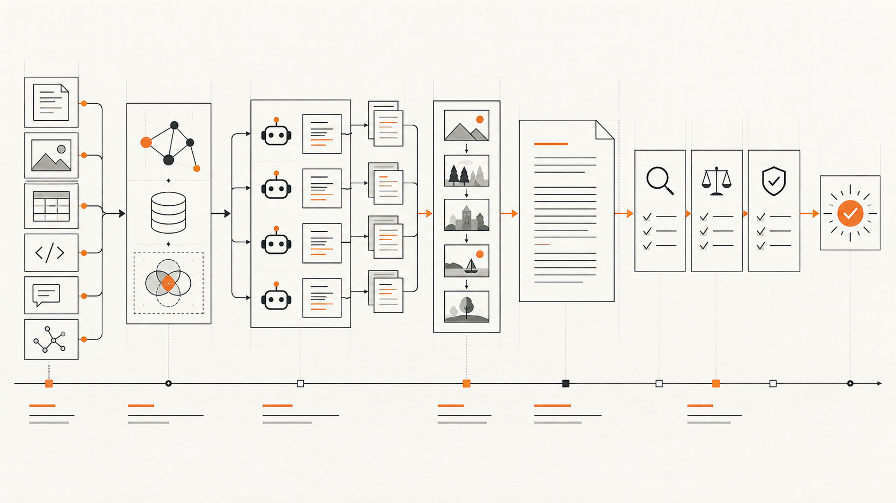
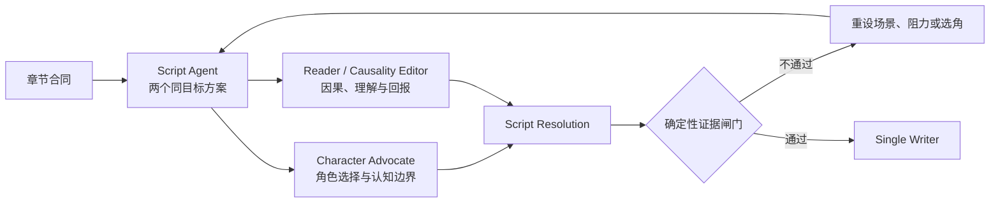
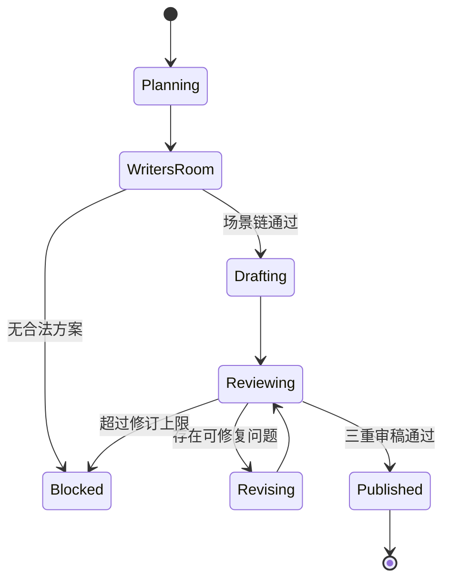
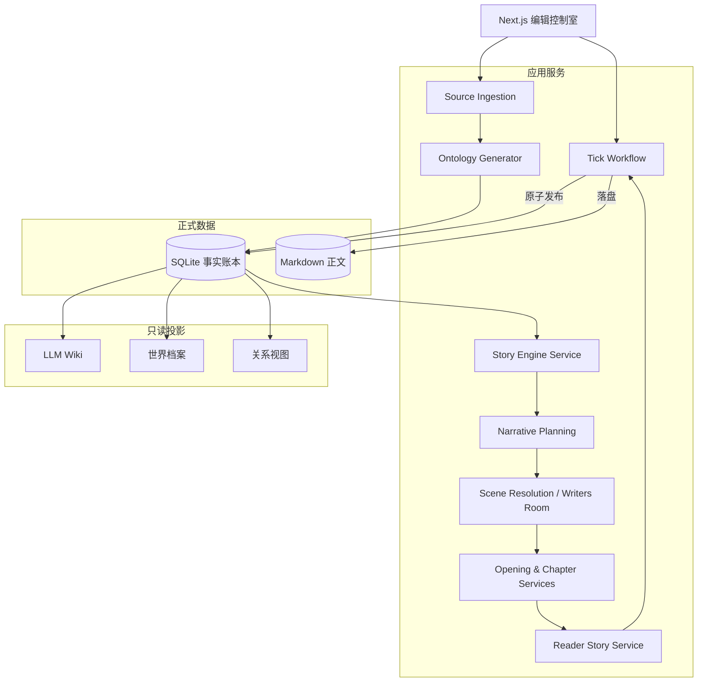

<div align="center">

# SeedWorld

### 让世界先发生，再把它写下来。

一个以事实账本、角色认知边界和滚动主线为基础的长篇小说创作工作台。

[产品定位](#产品定位) · [工作方式](#从资料到章节) · [系统架构](#系统架构) · [本地运行](#本地运行)

</div>



## 产品定位

SeedWorld 不是一次性扩写提示词的写作界面，也不是让一群角色漫无目的自由行动的社会模拟器。

它试图解决的是长篇小说最容易失控的部分：设定越来越多、人物知道了不该知道的事、事件与章节脱节、后续剧情忘记前文代价，以及多个 Agent 的输出最终被拼成流水账。

系统因此把一次正式创作固定成一条可追踪的生产链：

```text
作品资料
→ 动态本体与事实账本
→ 作品故事发动机
→ 当前故事弧
→ 下一章微型故事合同
→ 多 Agent 编剧会
→ 单一 Writer 成章
→ 三重审稿
→ 原子发布
```

SeedWorld 只把已经发布的事实视为正式世界状态。方案、讨论、草稿和待提交变化都不会提前污染世界。

## 核心设计

### 1. 事实、角色认知与读者认知分离

同一件事在系统中可以同时拥有三种不同状态：

- 世界中客观发生了什么；
- 某个角色相信、怀疑或拒绝什么；
- 正文已经让读者知道或可以推断什么。

这让秘密、误解、谣言、信息差和有限视角不再只依赖提示词提醒，而能成为可校验的数据边界。

### 2. 每部作品拥有自己的动态 Ontology

平台只固定 `Entity`、`Claim`、`Event`、`Rule`、`KnowledgeState` 和 `Transmission` 等表达机制。人物、势力、异能、合同、门派、疾病或超自然现象，都由当前作品资料生成，不写死成平台题材模板。

### 3. 当前故事弧是硬主线，终局不是开篇前提

系统不要求作者在第一章前就决定最终真相与人物结局。它锁定的是当前故事弧的目标、阻力、完成条件和代价，并维护多个尚未承诺的远期方向。

每章只需要回答一个更可靠的问题：

> 当前故事弧距离完成还缺少什么，而上一章造成了什么必须处理的后果？

### 4. 世界演化与正文写作不再分家

一次正式 Tick 对应一章。角色意图只参与场景论证，不能直接变成小说句子；章节发布失败时，世界也不会偷偷前进。

### 5. Writer 是正文的唯一作者

角色 Agent、剧本 Agent 和专家 Agent 只返回结构化意图、问题与修复方向。最终只有一个 Writer 读取批准后的连续场景链，完成整章正文，避免按 Agent 顺序逐个汇报。

## 从资料到章节



### 资料编译

作者可以输入世界底稿，也可以导入 Markdown、TXT 或 PDF。编译过程保留原文、来源、分块与批次信息，再从中抽取实体、命题、规则、历史事件和知识边界。

SQLite 是唯一事实源。Wiki、关系视图和摘要只是用于阅读与检索的派生投影，不具备反向篡改事实的权限。

### 故事发动机

资料完成后，系统为当前作品生成一份可编辑的 Story Engine 草案，用来说明：

- 本书反复兑现的核心体验；
- 能持续制造冲突的情境；
- 主角常用的解决方式与它的局限；
- 对抗来源、稀缺资源和失败代价；
- 成长回报、变化轴与枯竭信号。

故事发动机需要作者确认。它约束“这部作品为什么值得继续读”，但不会替角色预先决定结局。

### 下一章微型故事合同

系统始终只详细锁定下一章。每份合同必须包含：

| 字段 | 作用 |
| --- | --- |
| 即时目标 | POV 在本章想完成的具体事情 |
| 核心阻碍 | 真正阻止目标的力量 |
| 困难选择 | 至少两个都需要付出代价的选项 |
| 状态变化 | 本章结束后正式世界中发生的主要变化 |
| 局部回报 | 本章真正给读者的答案、胜负、发现或情绪结算 |
| 下一压力 | 由本章结果自然产生的后续问题 |
| 删除损失 | 删除本章后会断裂的明确因果 |

首章使用更严格的信息预算：最多三名具名人物和一个陌生核心概念，并由独立的 Opening Workshop 负责入口压力、读者锚点与首章钩子。

### 自适应编剧会

普通章节使用精简编剧会，高风险章节才启用完整专家组。



完整编剧会可以进一步启用：

- `MainlineGuardian`：检查是否推动当前故事弧；
- `CausalityCritic`：检查触发、行动、反馈与后果；
- `ContinuityKeeper`：检查时间、地点、设定和已发布正文；
- `ReaderAdvocate`：检查信息量、局部回报和理解成本；
- `DevilsAdvocate`：寻找巧合、降智与便利解法；
- `CharacterAdvocate`：为关键角色的真实选择辩护。

系统不采用投票。事实错误、知识越权或人物边界错误，不会因为多数 Agent 支持而被放行。

### 三重审稿

正文生成后依次接受三种审查：

1. **文学审稿**：检查单一视角、微型故事弧、节奏、对话职责、人物出场必要性、钩子和流水账问题。
2. **读者理解审稿**：在不读取答案版世界档案的前提下，复述人物目标、阻碍、选择、结果和局部回报。
3. **状态证据审稿**：为每项世界变化寻找正文证据，并检查人物知识、能力代价、时间地点与世界规则。

任一审查出现关键错误，正文都不能发布。

### 原子发布

通过审稿后，正文、事件、状态变化、人物认知、关系、读者揭示、问题状态和故事弧进度才会在同一次事务中提交。



## 系统架构



### 代码中的主要边界

```text
app/
  api/worlds/                 世界、资料、推演与章节 API
  worlds/                     作品库、创建页与作品工作台

src/domain/
  narrative-workflow.ts       章节合同、状态变化与工作流领域类型
  story-engine-validation.ts  故事发动机约束
  story-closure-validation.ts 滚动主线与收敛条件

src/server/
  extraction-service.ts       资料编译
  story-engine-service.ts     作品故事发动机
  narrative-planning-service.ts  当前弧与下一章规划
  scene-resolution-service.ts    编剧会与场景收敛
  opening-workshop-service.ts    首章专用工作坊
  opening-chapter-service.ts     首章正文流水线
  chapter-service.ts             常规章节生成与审稿
  reader-story-service.ts        读者问题和理解状态
  tick-workflow-service.ts       一轮一章的可恢复工作流
  database.ts                    SQLite schema 与迁移
```

## 工作台

SeedWorld 的界面不是一次性向导，而是三个长期工作空间：

- **创作台**：查看当前故事弧、下一章合同、编剧会、推演状态和审稿证据；
- **设定库**：检查实体、规则、事实来源、角色认知、秘密与关系；
- **章节库**：阅读、比较和管理已经发布的 Markdown 章节。

视觉系统采用暖纸背景、黑墨文字、方形边界和单一橙色焦点。它更接近编辑部的连续账本，而不是卡片堆叠的通用后台。

## 技术栈

- Next.js 14 / React 18 / TypeScript
- SQLite 本地持久化
- OpenAI-compatible / Anthropic-compatible 模型适配
- Zod 结构化输出校验
- Vitest + Testing Library
- Graphology / Sigma（仅用于可选关系视图）

## 本地运行

```bash
npm install
cp .env.example .env.local
npm run dev
```

默认访问：`http://localhost:3000`

模型密钥只保存在服务端环境变量中，不应写入代码、数据库、浏览器存储或提交记录。

常用校验：

```bash
npm test
npm run build
```

## 当前边界

SeedWorld 仍处于持续演进阶段。仓库中保留了部分早期世界模拟与关系视图代码，用于兼容旧作品和沙盒预演；正式小说生产链以 SQLite 事实账本、当前故事弧、一轮一章工作流和原子发布为准。

文档不会宣称尚未验证的生成质量、性能指标或用户规模。判断系统是否可用，应以真实首章、连续章节和完整故事弧的回归验收为准。

---

<div align="center">

**SeedWorld — 世界负责留下后果，章节负责赋予后果意义。**

</div>
